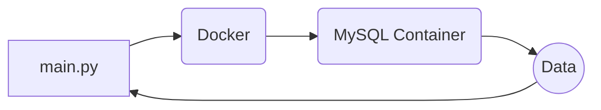

# IP-Sifter By SpiceySec

This programme was made to organise a list of IPs and Gamertags in which I have obtained and will let a user, **add**, **delete** or **update** rows or selected columns via **ids**. All in all it is a useful way of **finding or collecting data** with a clean, easy to work with interface.

## File System

The main programme is **main.py** and this will be the programme you will run, to access the data stored in the database, it will **not** run at all if the programme can not **connect** to the database, so make sure docker is running with **MySQL**. You should also have already made a database within **MySQL** also (later revision may have a script included to do this automatically). Details of the database will be below in the **database structure wireframe**.

The Extraction of data from **CSV** formatted files will be executed within the **seperate_csv.py** programme, just **uncomment/comment** parts of the script so it suits your needs (later revisions may separate this out into an interface for you).

## Database Design

|id|Gamertag|IP|
|-------|--------|--------|
|1|player1|3.3.3.3|
|2|player2|2.2.2.2|
|3|player3|1.1.1.1|

>**Please note only the columns are needed the data within (rows) will be added through your CSV or through manual input on the Admin page in the programme.**

## Programme Flow

>**This programme has an incredibly simple flow and can easily be understood by anyone.**
